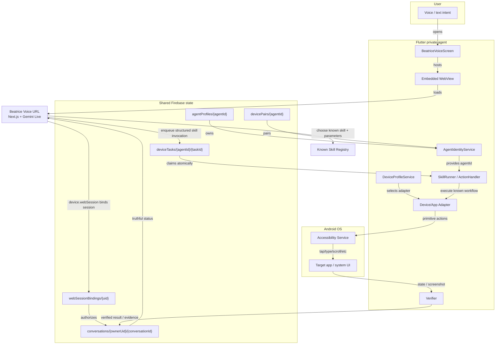

# OSBeatrice

OSBeatrice is a split-stack voice-operated computer assistant:

- **Beatrice-Voice** — Next.js web app that acts as the conversational
  orchestrator. It runs in a browser and, when embedded, inside the Android
  private-agent via a WebView at `https://osbeatrice.vercel.app/`.
- **private-agent** — Flutter Android app that acts as the deterministic
  device-execution plane. It owns the install-scoped agent identity and runs
  tasks on the phone.

**Important:** Beatrice Voice is not becoming a separate app. The embedded
WebView URL architecture is preserved. The refactor changes the orchestration
contract underneath the WebView, not the UI delivery model.

The two apps coordinate through **Firebase Realtime Database**, not through
arbitrary model-generated commands.



## Architecture rule

> Beatrice may choose a registered skill. The agent may execute a registered
> workflow. Neither may invent an execution path.
>
> No verifier evidence, no “done.”

## Repository layout

```
.
├── Beatrice-Voice/    # Next.js 16 web app
│   ├── src/app/        # page.tsx, task_api/route.ts
│   ├── src/services/  # gemini.ts, tools.ts, ollama.ts, flux.ts
│   └── README.md       # Web app details
└── private-agent/      # Flutter Android executor
    ├── lib/            # Dart UI and services
    ├── android/        # Kotlin native accessibility bridge
    └── README.md       # Android app details
```

## Current migration status

Phase 1 of the structured-skill migration is complete:

- Canonical `agentId` with legacy `deviceId` migration
- Device profile capture via native MethodChannel
- Atomic four-record pairing handshake
- WebView `task.create` removed; all execution through Firebase queue
- `/task_api` bound to `agentProfiles/{agentId}/ownerUid`

Beatrice Voice remains the **embedded WebView URL**, not a separate app.

See `private-agent/ROADMAP.md` and
`Beatrice-Voice/src/services/SKILL_PROTOCOL_NOTES.md` for the full plan.
